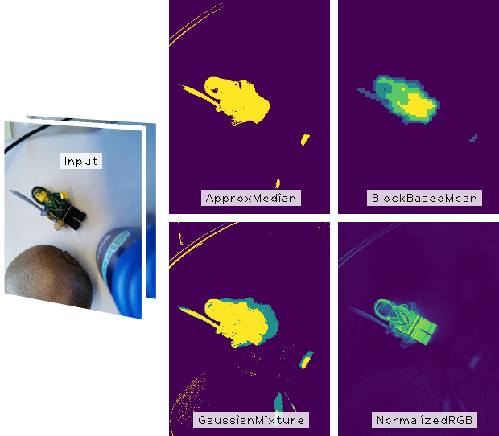
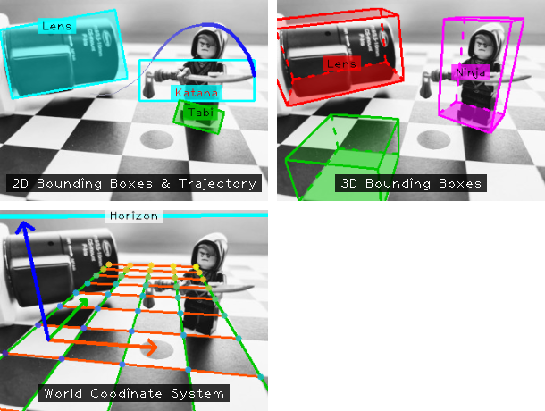
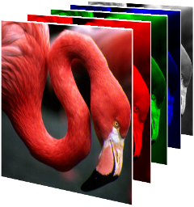

# vitocpp/vcp
C++/Python 3 utilities for common vision tasks, e.g. streaming, visualization or image manipulation.

<b>Note:</b> As of 01/2020 this repository is <b>WIP</b>, I'm rewriting my utilities (especially simplifying the streaming module) over the next couple of months.

```
Current status:
cloc --exclude-dir=.venv3,build,third-party,gen,doc --exclude-lang=make .
-------------------------------------------------------------------------------
Language                     files          blank        comment           code
-------------------------------------------------------------------------------
C++                             59           3506           2001          18442
C/C++ Header                    49           1373           1515           3721
CMake                           21            372            465           1656
Python                          16            385            425           1142
Markdown                         2             48              0            239
Bourne Shell                     3             37             70            217
-------------------------------------------------------------------------------
SUM:                           150           5721           4476          25417
-------------------------------------------------------------------------------
```

## What is it good for?
Some of `vcp`'s highlights:
* <b>Best effort multiple device streaming</b> with the `vcp::best` module. Useful for quick camera tests and whenever (guaranteed) synchronisation isn't crucial. The goal of this module is to stream from multiple devices simultaneously, without having the ROS overhead. A simple libconfig++-style configuration file allows you to process all streams both in C++ and python. For more details, see the [separate BESt.md documentation](BESt.md).
* <b>Background subtraction</b> is provided by the `vcp::bgm` module, for example:

  
* <b>Visualization utilities</b> are provided by the `vcp::imvis` module, for example:

  
* <b>Pseudocoloring</b> for data visualization/analysis is also provided by the `vcp::imvis` module.
  Back when I started working on this library, OpenCV didn't provide pseudocoloring capabilities. The `vcp::imvis` module allows visualization via common color maps (you might remember these from such frameworks as MATLAB, matplotlib, and whatnot).

  
* <b>Math</b> utilities - besides enabling most of the fancy visualizations within `vcp::imvis`, you can also do basic geometry tasks with the `vcp::math` module (e.g. computing tangents of circles, line (segment) intersection, and quite a lot more).
TODO add line intersect example, tangents, poly (chull, rdp)
* <b>C++</b> utilities - for basic file/path and string manipulation, sorting, and more (if you want to avoid heavier dependencies, such as Boost).


## Repository Contents
* `./build-scripts` - shell scripts to prepare the build system, build the libraries, etc.
* `./cmake` - CMake utilities (incl. custom `Find<package>.cmake` scripts).
* `./examples` - example usage of these utilities.
* `./src` - source code for all C++ modules and python bindings.
* `./third-party` - third party dependencies (which are not part of default system packages).


## Installation
* If you want to build the C++ library and Python3 bindings, simply run `./build-scripts/build-ubuntu-18.04.sh`, this will:
  * Check and ask you to install missing system packages.
  * Configure the build (depending on which optional packages you installed, e.g. `libk4a` to stream from Azure Kinect).
  * Build the C++ `vcp` libraries and corresponding Python3 bindings.
  * Build the example applications and prepare the virtual environment for Python demos.
* If you prefer to do it on your own, crank up CMake:
    ```bash
    $ cd <VCP_ROOT_DIR>
    $ mkdir build && cd build
    $ cmake -DVCP_BUILD_PYTHON=ON ..
    $ make -j install
    ```
* The default install location (for `make install`) of `vcp` is `<VCP_ROOT_DIR>/gen`.
  * Public C++ headers are inside `<VCP_ROOT_DIR>/gen/include`.
  * `vcp` library files are inside `<VCP_ROOT_DIR>/gen/lib`.
  * The Python3 package is located at `<VCP_ROOT_DIR>/gen/vcp`.


## Tools
This repository comes with a few "tools", i.e. standalone applications that go beyond simple demos/examples.
Currently, there are only python applications, which you can find at `<VCP_ROOT_DIR>/examples/python3/tools`.
* Set up the <b>virtual environment</b>. If you didn't use the `./build-scripts/build-X.sh` script to prepare the library, you should run:
  ```bash
  $ cd <VCP_ROOT_DIR>/examples/python3
  $ ./prepare_environment_py3.sh
  $ source .venv3/bin/activate
  ```
* <b>3D image plots</b>. Plot a single image (`plot-image.py`) or an image sequence (`plot-image-sequence.py`) by interactively adjusting the camera extrinsics.

  
* <b>Image abstraction:</b> cartoonification, pixelation, etc. can be experimented with via `cartoonify.py`.


## Examples
### C++
* The C++ applications at `<VCP_ROOT_DIR>/examples/cpp` demonstrate how you can use `vcp` from your own CMake projects. After building the vcp library, building these examples is as easy as:
  ```bash
  $ cd <VCP_ROOT_DIR>/examples
  $ mkdir build && cd build
  $ cmake ..
  $ make -j
  ```
* Highly recommended examples (best/well documented, useful functionality):
  * `best_demo`
  * `imvis_demo` TODO
  * `imutils_demo` TODO


### Python
* You can find Python3 examples for all modules at `<VCP_ROOT_DIR>/examples/python3`.
  ```bash
  $ cd <VCP_ROOT_DIR>/examples/python3
  # Set up the virtual environment
  $ ./prepare_environment_py3.sh
  $ source .venv3/bin/activate
  $ python imvis_demo.py
  ```
* Highly recommended examples (best/well documented, useful functionality):
  * `bgm_demo.py`

## Tests
While all of vcp has been tested "in-the-wild", unit tests are rather sparse, unfortunately.
Especially for the "best effort streaming" module, tests become quite difficult to automate (threading + the need for the specific hardware connected to the test server).

Anyhow, testing requires `gtest`, which you'll probably need to build yourself - this is a no-brainer, see:
* Set up `libgtest`:
  ```bash
  $ sudo apt-get install libgtest-dev

  # This package does not provide binaries, so look for the installed
  # source at /usr/src. It should be (Ubuntu 18.04) at /usr/src/googletest.
  $ cd /usr/src/googletest
  $ sudo cmake CMakeLists.txt
  $ sudo make

  # Copy or symlink googlemock/gtest/libgtest.a 
  # and googlemock/gtest/libgtest_main.a to your /usr/lib folder
  $ sudo cp googlemock/gtest/*.a /usr/lib
  ```
* Now `vcp` can be tested:
  ```bash
  $ cd <VCP_ROOT_DIR>/build

  # Enable tests and link the gtest libraries
  $ cmake -DVCP_BUILD_TESTS=ON ..
  $ make test 

  # Or, if you prefer:
  $ ctest -V
  ```


##TODOs
* [ ] BESt module
  * [ ] Load intrinsics
  * [ ] Load extrinsics
  * [ ] Rectify streams
    * [ ] Mono
    * [ ] Stereo
    * [ ] RGB+D
  * [x] Monocular/stereo
    * [x] Stereo IP cam streams as separate monocular sinks
    * [x] "Real" stereo cams (e.g. ZED) could be split in VCP or by the library user (currently, the latter is preferred)
    * [ ] Add frame-type stereo-left, stereo-right for rectification (if needed)
  * [x] RealSense
  * [ ] Azure Kinect
    * [x] Stream raw data
    * [x] Align RGB+D
    * [ ] Query intrinsics
  * [ ] mvBlueFox
  * [ ] Mobotix, etc.
* [ ] Python bindings
  * [ ] best
* [ ] Move python demos (e.g. math2d/3d) to unit tests
* [ ] Increase unit test coverage
* [ ] C++ Tools/examples
  * [ ] Viewer
  * [ ] Capturing tool
* [ ] Camera calibration (nice-to-have)
* [ ] Tracking module

